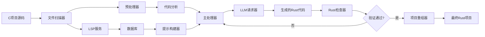

# C2Rust Agent

[English](README.md) | [中文](README-CN.md)

基于大语言模型的智能C项目到Rust项目转换工具，具备数据库驱动的上下文感知和LSP分析功能。

[](https://www.rust-lang.org)
[](https://opensource.org/licenses/MIT)
[]()

## 项目概述

C2Rust Agent 是一个先进的工具，利用大语言模型（LLM）将C项目转换为惯用的Rust代码。与简单的语法转换器不同，它通过LSP分析、数据库驱动的上下文和智能项目重组提供语义理解。

## 核心特性

- **🧠 LLM驱动翻译**: 使用先进的语言模型（OpenAI、Ollama、XAI、DeepSeek）进行语义理解
- **🔍 LSP分析**: 使用语言服务器协议深度代码分析，理解依赖关系和关联性
- **🗄️ 数据库上下文**: 使用SQLite和Qdrant向量数据库持久化存储，实现上下文感知翻译
- **📁 项目重组**: 自动将分散的翻译重组为正确的Rust工作空间结构
- **⚡ 并发处理**: 并行处理，带有进度跟踪和重试机制
- **🎯 多种项目类型**: 支持单文件、配对文件（头文件/源文件）和复杂的多模块项目
- **✅ 验证**: 自动Rust编译器验证，带有错误反馈循环

## 系统架构



注意：如果Mermaid图表在您的查看器中无法渲染，请在GitHub上打开此文件或使用VS Code的Markdown预览。

核心组件：

- LSP服务：分析代码结构和关系
- 数据库服务：存储分析和嵌入（SQLite + Qdrant）
- 预处理器：缓存文件并拆分编译单元
- 主处理器：协调翻译工作流程，包含重试逻辑
- 提示构建器：为高质量提示组装上下文
- LLM请求器：提供商无关的LLM API层
- Rust检查器：编译并反馈错误以进行改进

## 安装

### 系统要求

- Rust 1.70+
- C/C++编译器（用于clangd LSP）
- Clangd语言服务器
- Docker（可选，用于容器化设置）

### 源码构建

```bash
git clone https://github.com/yourusername/c2rust_agent.git
cd c2rust_agent
cargo build --release
```

### Docker设置

```bash
docker-compose up -d
```

## 配置

创建 config.toml：

```toml
# LLM提供商选择
provider = "ollama"  # 选项: "ollama", "openai", "xai", "deepseek"

# LLM提供商配置
[llm.ollama]
model = "deepseek-r1:7b"
base_url = "http://localhost:11434"
api_key = ""

[llm.openai]
model = "gpt-4"
api_key = "your_openai_api_key_here"

[llm.xai]
model = "grok-beta"
api_key = "your_xai_api_key_here"

[llm.deepseek]
model = "deepseek-chat"
api_key = "your_deepseek_api_key_here"

# 数据库配置
[qdrant]
host = "localhost"
port = 6333
collection_name = "default"
vector_size = 1536

[sqlite]
path = "data.db"

# 处理配置
[main_processor]
max_retry_attempts = 3
concurrent_limit = 4
```

## 使用方法

### 命令行界面

```bash
# 基本翻译工作流程
cargo run --bin commandline_tool -- translate /path/to/c/project

# 使用数据库上下文
cargo run --bin commandline_tool -- preprocess /path/to/c/project
cargo run --bin commandline_tool -- translate /path/to/c/project

# 分析项目结构
cargo run --bin commandline_tool -- analyze /path/to/c/project

# 查询关系
cargo run --bin commandline_tool -- relation-query "function_name"
```

### 编程接口

```rust
use main_processor::{MainProcessor, pkg_config};
use cproject_analy::PreProcessor;

#[tokio::main]
async fn main() -> anyhow::Result<()> {
    // 步骤1：预处理C项目（复杂项目需要）
    let mut preprocessor = PreProcessor::new_default();
    preprocessor.initialize_database().await?;
  
    let stats = preprocessor.preprocess_project(
        &std::path::Path::new("/path/to/c/project"),
        &std::path::Path::new("./cache")
    ).await?;
  
    // 步骤2：主处理（翻译）
    let config = pkg_config::get_config()?;
    let processor = MainProcessor::new(config);
  
    // 单文件/目录
    processor.process_single("/path/to/c/project").await?;
  
    // 批处理
    let paths = vec![/* your paths */];
    processor.process_batch(paths).await?;
  
    Ok(())
}
```

### GUI界面

```bash
cargo run --bin ui_main
```

启动基于Dioxus的Web界面进行交互式翻译。

## 翻译工作流程

### 对于C项目（推荐）：

1. **预处理**：使用 `cproject_analy` 分析和缓存项目结构
2. **主处理**：使用 `main_processor` 进行LLM驱动的翻译
3. **重组**：使用 `project_remanager` 创建合适的Rust工作空间

```bash
# 完整工作流程
cargo run --bin commandline_tool -- preprocess ./c_project
cargo run --bin commandline_tool -- translate ./c_project
cargo run --bin project_remanager -- ./cache/src_cache ./output/rust_project
```

### 处理流水线

1. **发现**：扫描C项目结构并识别编译单元
2. **分析**：使用LSP服务理解代码关系和依赖
3. **缓存**：预处理器创建优化的缓存和文件映射
4. **上下文构建**：使用数据库知识生成丰富的上下文提示
5. **翻译**：LLM基于语义理解将C代码转换为Rust
6. **验证**：Rust编译器检查生成的代码
7. **改进**：如果编译失败，基于错误反馈自动重试
8. **重组**：将单独的翻译组装成统一的工作空间

## 支持的项目类型

- **单文件**：简单的C程序（`main.c` → main.rs）
- **配对文件**：头文件/源文件对（`.h/.c` → lib.rs + 模块）
- **多模块**：具有多个独立模块的复杂项目
- **库项目**：没有main函数的项目成为库crate
- **混合工作空间**：二进制文件和库的组合

## 翻译特性

- **内存安全**：自动转换为Rust所有权系统
- **错误处理**：使用 `Result<T, E>` 类型进行错误传播
- **空值安全**：对可空指针使用 `Option<T>`
- **惯用模式**：迭代器、模式匹配和Rust约定
- **Unsafe注释**：在需要时自动添加 `unsafe` 块
- **C兼容性**：为C兼容结构体添加 `#[repr(C)]`
- **FFI支持**：正确的 `extern "C"` 函数声明

## 示例

### 单文件翻译

```rust
use main_processor::{MainProcessor, pkg_config};

let config = pkg_config::get_config().unwrap_or_default();
let processor = MainProcessor::new(config);
processor.process_single("./example.c").await?;
```

### 项目重组

```rust
use project_remanager::ProjectReorganizer;

let reorganizer = ProjectReorganizer::new(
    "./cache/src_cache".into(),
    "./output/rust_project".into()
);
reorganizer.reorganize()?;
```

参见 `examples/` 获取完整示例。

## 开发

### 构建

```bash
cargo build
cargo test
```

### 运行测试

```bash
# 运行所有测试
cargo test

# 特定crate测试
cargo test -p main_processor
cargo test -p project_remanager
```

### 贡献

1. Fork本仓库
2. 创建特性分支
3. 为新功能添加测试
4. 确保所有测试通过
5. 提交pull request

## Crate文档

- `main_processor` - 核心翻译引擎
- `cproject_analy` - C项目预处理
- `project_remanager` - 工作空间重组
- `lsp_services` - LSP集成
- `db_services` - 数据库管理

## 限制

- 需要手动审查生成的unsafe代码
- 复杂宏展开可能需要改进
- 平台特定代码需要注意
- 大型项目可能需要迭代处理
- 大量翻译的LLM API成本

## 性能

- **并发处理**：通过 `MainProcessorConfig` 配置并行度
- **缓存**：智能缓存减少冗余API调用
- **数据库索引**：向量相似性搜索用于上下文检索
- **进度跟踪**：实时进度条和统计信息

## 许可证

本项目采用MIT许可证 - 详见LICENSE文件。

## 致谢

- Rust社区提供的优秀工具 — https://www.rust-lang.org/
- LLVM clangd团队 — https://clangd.llvm.org/
- SQLite — https://www.sqlite.org/
- Qdrant — https://qdrant.tech/
- Dioxus — https://dioxuslabs.com/
- c2rust（灵感来源）— https://github.com/immunant/c2rust
- Ollama — https://ollama.com/
- OpenAI — https://openai.com/
- xAI — https://x.ai/
- DeepSeek — https://deepseek.com/

## 支持

- � 问题反馈：[GitHub Issues](https://github.com/rust4c/c2rust_agent/issues)
- 📧 联系方式：m18511047688@163.com
