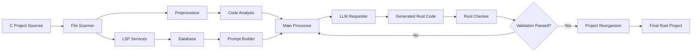

# C2Rust Agent

[English](README.md) | [中文](README-CN.md)

An intelligent LLM-powered tool for converting C projects to idiomatic Rust code with database-driven context awareness and LSP analysis.

[](https://www.rust-lang.org)
[](https://opensource.org/licenses/MIT)
[]()

## Overview

C2Rust Agent is a sophisticated tool that leverages Large Language Models (LLMs) to translate C projects into idiomatic Rust code. Unlike simple syntax translators, it provides semantic understanding through LSP analysis, database-driven context, and intelligent project reorganization.

## Key Features

- **🧠 LLM-Powered Translation**: Uses advanced language models (OpenAI, Ollama, XAI, DeepSeek) for semantic understanding
- **🔍 LSP Analysis**: Deep code analysis using Language Server Protocol for understanding dependencies and relationships
- **🗄️ Database Context**: Persistent storage with SQLite and Qdrant vector database for context-aware translations
- **📁 Project Reorganization**: Automatically reorganizes scattered translations into proper Rust workspace structure
- **⚡ Concurrent Processing**: Parallel processing with progress tracking and retry mechanisms
- **🎯 Multiple Project Types**: Supports single files, paired files (header/source), and complex multi-module projects
- **✅ Validation**: Automatic Rust compiler validation with error feedback loops

## Architecture



Note: If the Mermaid diagram does not render in your viewer, open this file on GitHub or use VS Code's Markdown Preview.

Core components:

- LSP Services: Analyzes code structure and relationships
- Database Services: Stores analysis and embeddings (SQLite + Qdrant)
- Preprocessor: Caches files and splits compilation units
- Main Processor: Orchestrates translation with retry logic
- Prompt Builder: Context assembly for high-quality prompts
- LLM Requester: Provider-agnostic LLM API layer
- Rust Checker: Compiles and feeds back errors for refinement

## Installation

### Prerequisites

- Rust 1.70+
- C/C++ compiler (for clangd LSP)
- Clangd language server
- Docker (optional, for containerized setup)

### Build from Source

```bash
git clone https://github.com/yourusername/c2rust_agent.git
cd c2rust_agent
cargo build --release
```

### Docker Setup

```bash
docker-compose up -d
```

## Configuration

Create config.toml:

```toml
# LLM provider selection
provider = "ollama"  # Options: "ollama", "openai", "xai", "deepseek"

# LLM provider configurations
[llm.ollama]
model = "deepseek-r1:7b"
base_url = "http://localhost:11434"
api_key = ""

[llm.openai]
model = "gpt-4"
api_key = "your_openai_api_key_here"

[llm.xai]
model = "grok-beta"
api_key = "your_xai_api_key_here"

[llm.deepseek]
model = "deepseek-chat"
api_key = "your_deepseek_api_key_here"

# Database configuration
[qdrant]
host = "localhost"
port = 6333
collection_name = "default"
vector_size = 1536

[sqlite]
path = "data.db"

# Processing configuration
[main_processor]
max_retry_attempts = 3
concurrent_limit = 4
```

## Usage

### Command Line Interface

```bash
# Basic translation workflow
cargo run --bin commandline_tool -- translate /path/to/c/project

# With database context
cargo run --bin commandline_tool -- preprocess /path/to/c/project
cargo run --bin commandline_tool -- translate /path/to/c/project

# Analyze project structure
cargo run --bin commandline_tool -- analyze /path/to/c/project

# Query relationships
cargo run --bin commandline_tool -- relation-query "function_name"
```

### Programmatic API

```rust
use main_processor::{MainProcessor, pkg_config};
use cproject_analy::PreProcessor;

#[tokio::main]
async fn main() -> anyhow::Result<()> {
    // Step 1: Preprocess C project (required for complex projects)
    let mut preprocessor = PreProcessor::new_default();
    preprocessor.initialize_database().await?;
  
    let stats = preprocessor.preprocess_project(
        &std::path::Path::new("/path/to/c/project"),
        &std::path::Path::new("./cache")
    ).await?;
  
    // Step 2: Main processing (translation)
    let config = pkg_config::get_config()?;
    let processor = MainProcessor::new(config);
  
    // Single file/directory
    processor.process_single("/path/to/c/project").await?;
  
    // Batch processing
    let paths = vec![/* your paths */];
    processor.process_batch(paths).await?;
  
    Ok(())
}
```

### GUI Interface

```bash
cargo run --bin ui_main
```

Launch the Dioxus-based web interface for interactive translation.

## Translation Workflow

### For C Projects (Recommended):

1. **Preprocessing**: Use `cproject_analy` to analyze and cache project structure
2. **Main Processing**: Use `main_processor` for LLM-powered translation
3. **Reorganization**: Use `project_remanager` to create proper Rust workspace

```bash
# Complete workflow
cargo run --bin commandline_tool -- preprocess ./c_project
cargo run --bin commandline_tool -- translate ./c_project
cargo run --bin project_remanager -- ./cache/src_cache ./output/rust_project
```

### Processing Pipeline

1. **Discovery**: Scans C project structure and identifies compilation units
2. **Analysis**: Uses LSP services to understand code relationships and dependencies
3. **Caching**: Preprocessor creates optimized cache and file mappings
4. **Context Building**: Generates rich context prompts using database knowledge
5. **Translation**: LLM converts C code to Rust with semantic understanding
6. **Validation**: Rust compiler checks generated code
7. **Refinement**: Automatic retry with error feedback if compilation fails
8. **Reorganization**: Assembles individual translations into cohesive workspace

## Supported Project Types

- **Single File**: Simple C programs (`main.c` → main.rs)
- **Paired Files**: Header/source pairs (`.h/.c` → lib.rs + modules)
- **Multi-Module**: Complex projects with multiple independent modules
- **Library Projects**: Projects without main functions become library crates
- **Mixed Workspaces**: Combination of binaries and libraries

## Translation Features

- **Memory Safety**: Automatic conversion to Rust ownership system
- **Error Handling**: `Result<T, E>` types for error propagation
- **Null Safety**: `Option<T>` for nullable pointers
- **Idiomatic Patterns**: Iterators, pattern matching, and Rust conventions
- **Unsafe Annotation**: Automatic `unsafe` blocks where needed
- **C Compatibility**: `#[repr(C)]` for C-compatible structs
- **FFI Support**: Proper `extern "C"` function declarations

## Examples

### Single File Translation

```rust
use main_processor::{MainProcessor, pkg_config};

let config = pkg_config::get_config().unwrap_or_default();
let processor = MainProcessor::new(config);
processor.process_single("./example.c").await?;
```

### Project Reorganization

```rust
use project_remanager::ProjectReorganizer;

let reorganizer = ProjectReorganizer::new(
    "./cache/src_cache".into(),
    "./output/rust_project".into()
);
reorganizer.reorganize()?;
```

See `examples/` for complete examples.

## Development

### Building

```bash
cargo build
cargo test
```

### Running Tests

```bash
# Run all tests
cargo test

# Specific crate tests
cargo test -p main_processor
cargo test -p project_remanager
```

### Contributing

1. Fork the repository
2. Create a feature branch
3. Add tests for new functionality
4. Ensure all tests pass
5. Submit a pull request

## Crate Documentation

- `main_processor` - Core translation engine
- `cproject_analy` - C project preprocessing
- `project_remanager` - Workspace reorganization
- `lsp_services` - LSP integration
- `db_services` - Database management

## Limitations

- Requires manual review of generated unsafe code
- Complex macro expansions may need refinement
- Platform-specific code requires attention
- Large projects may need iterative processing
- LLM API costs for extensive translations

## Performance

- **Concurrent Processing**: Configurable parallelism via `MainProcessorConfig`
- **Caching**: Intelligent caching reduces redundant API calls
- **Database Indexing**: Vector similarity search for context retrieval
- **Progress Tracking**: Real-time progress bars and statistics

## License

This project is licensed under the MIT License - see the LICENSE file for details.

## Acknowledgments

- Rust community for excellent tooling — https://www.rust-lang.org/
- LLVM clangd team — https://clangd.llvm.org/
- SQLite — https://www.sqlite.org/
- Qdrant — https://qdrant.tech/
- Dioxus — https://dioxuslabs.com/
- c2rust (inspiration) — https://github.com/immunant/c2rust
- Ollama — https://ollama.com/
- OpenAI — https://openai.com/
- xAI — https://x.ai/
- DeepSeek — https://deepseek.com/

## Support

- 🐛 Bug Reports: [GitHub Issues](https://github.com/rust4c/c2rust_agent/issues)
- 📧 Contact: m18511047688@163.com
